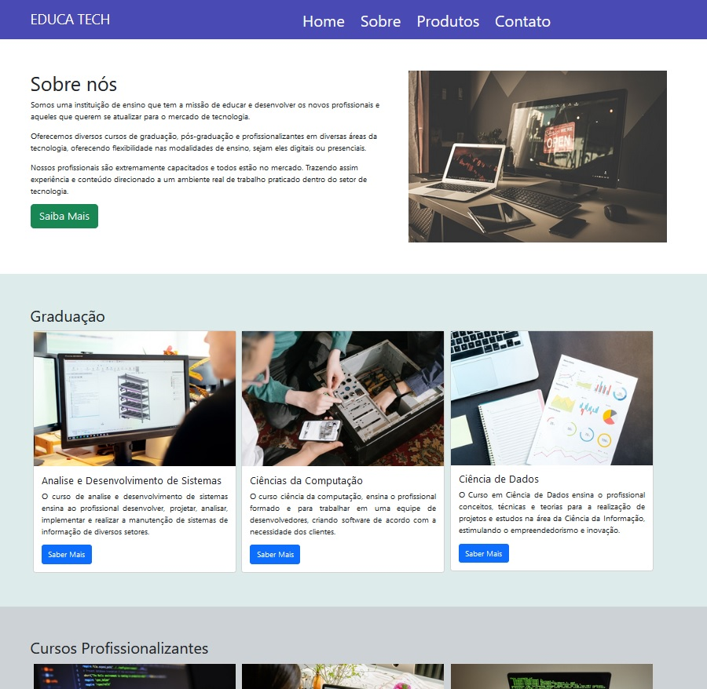

# Bootstrap-Academico

## 📝 Repositório de Estudo - Bootstrap
- Este repositório trata-se da aplicação do framework Bootstrap, para realizar modificações e incrementação em uma página web.

## 💻 Screenshot do projeto


## 📚 Seções

O projeto é composto das seguintes caracteristicas:
- **Biblioteca Bootstrap:** Utilização da biblioteca para incrementação na página web;
- **Carousel, cards e modals:** Utilização de itens da biblioteca para oferecer melhor experiência ao usuário;
- **Font awesome:** importação de icones para melhorar a experiência do usuário;

---

## 💼 Tecnologias utilizadas

Para o desenvolvimento do projeto foi utilizado as seguintes tecnologias:

- HTML;
- CSS;
- JavaScript;
- Bootstrap 5.2.0;
- Font Awesome;

---

## 🙋🏻‍♂️ Autor

Bruno Oliveira


Conteúdo abaixo são informações complementares sobre o framework:
# Bootstrap
- Framework ou biblioteca desenvolvimento
- Modular
- Componentes ricos
- CSS + JS
- Grid System
- Responsivo
- Mobile-first
- Amplamente utilizada
- Cross browser 

## Biblioteca x Framework
- Biblioteca: oferece objetos / classes prontas para uso
- Framework: oferece um conjunto de bibliotecas
- Biblioteca: recurso para trabalhar
- Framework: metodologia de trabalho
- Biblioteca: te leva ao destino
- Framework: te ensina a chegar

## Desenvolvimento ágil
- Metodologias: Scrum, Kanban, XP
- Entrega de valor para o negócio
- Ciclos evolutivos
- Não se repita
- Separar grandes projetos em pequenas entregas
- MVP - Mínimo Produto Viável
- Estar envolvido x comprometido

## Vantagens
- Uso simples
- Menos código
- Abstração de estilos
- Documentação completa: https://getbootstrap.com/

## Desvantagens
- Uso excessivo
- Override de estilos (sobreposição)
- Abstração de estilos

### Com Bootstrap
```
 <a class="btn btn-lg">Botão</a>
```

### Sem Bootstrap
```
 <a class="botao botao-grande">Botão</a>

 <style>
 html {
     font-size: 62.5% 
 }

 .botao {
    background-color: #ccc; 
    border-radius: 2px; 
    display: block;
    font-family: sans-serif;
    font-size: 1.6rem;
    padding: 1rem 2rem;
    margin: 5px auto;
    ...
 }

 .botao.grande {
    font-size: 2rem;
 }

 .botao:hover { ... }
 .botao:active { ... }
 .botao:visited { ... }
 
 </style>

```

## Componentes
- Blocos / Modelos / Templates reutilizáveis 
https://getbootstrap.com/docs/5.1/components


## Helpers 
- Funções básicas
- Incrementos 
- Ajustes
https://getbootstrap.com/docs/5.1/helpers


# Font Awesome
- Biblioteca de ícones
https://fontawesome.com/start/


# Exercicio
- incluir carousel na home antes de sobre
- completar o cadastro, tornando os campos obrigatórios
- incluir campos: bairro, complemento e telefone
