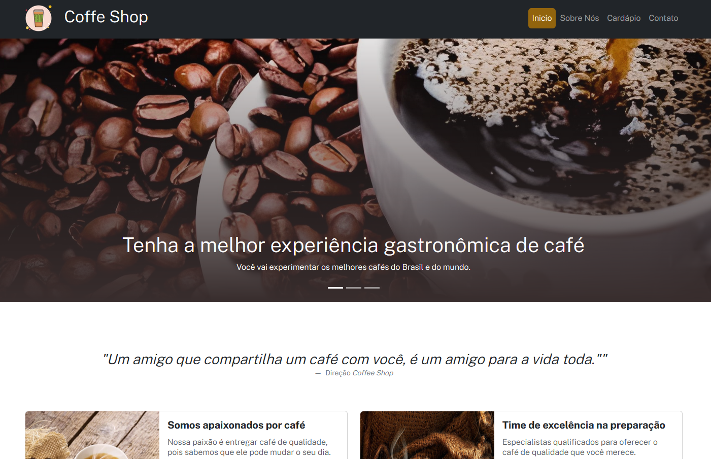

# 🏆 Coffee Shop

 

## 📎 Sumario

- 📌 Resumo do Projeto
- ⭐ Features
- 📂 Temas abordados
- ✔️ Tecnologias Utilizadas
- 💻 Demonstração
- 🙋🏻‍♂️ Autor

 

## 📌 Resumo do Projeto
O projeto é uma página web para uma cafeteria chamada “Coffee Shop”. A página utiliza HTML5, Bootstrap e CSS para criar uma interface responsiva e atraente. O código inclui um cabeçalho com um menu de navegação e um carrossel de imagens para exibir informações sobre a cafeteria. Há também uma seção “Sobre Nós” que apresenta informações sobre a cafeteria e sua paixão por café. A seção “Cardápio” apresenta opções de bebidas divididas em abas para expressos, cappuccinos e gelados. A seção “Contato” inclui um formulário para enviar mensagens à cafeteria e um mapa com a localização da cafeteria. O rodapé apresenta informações de contato e créditos.

 

## ⭐ Features
- Página web para uma cafeteria chamada “Coffee Shop”
- Utiliza HTML5, Bootstrap e CSS
- Interface responsiva e atraente
- Cabeçalho com menu de navegação
- Carrossel de imagens para exibir informações sobre a cafeteria
- Seção “Sobre Nós” com informações sobre a cafeteria
- Seção “Cardápio” com opções de bebidas divididas em abas
- Seção “Contato” com formulário para enviar mensagens e mapa com a localização da cafeteria
- Rodapé com informações de contato e créditos.

 

## 📂 Temas abordados
- HTML5: linguagem de marcação utilizada para estruturar o conteúdo da página
- Bootstrap: framework CSS utilizado para estilizar a página e torná-la responsiva
- Design responsivo: conceito aplicado para garantir que a página se adapte a diferentes tamanhos de tela
- CSS: linguagem de estilo utilizada para estilizar a página
- JavaScript: linguagem de programação utilizada pelo Bootstrap para adicionar interatividade à página (por exemplo, o menu de navegação em dispositivos móveis)
- jQuery: biblioteca JavaScript utilizada para simplificar o desenvolvimento de scripts do lado do cliente
- jQuery Mask: plugin jQuery utilizado para adicionar máscaras aos campos do formulário
- jQuery Validate: plugin jQuery utilizado para validar os campos do formulário.

 

## ✔️ Tecnologias Utilizadas

 

## 💻 Demonstração
Para visualizar uma prévia do projeto <a href="https://coffee-shop-one-liard.vercel.app/" target="_blank"><b>clique aqui</b></a>

 

## 🙋🏻‍♂️ Autor
| [ Bruno Oliveira](https://github.com/BrunoOliveira16) |
| :---: |
